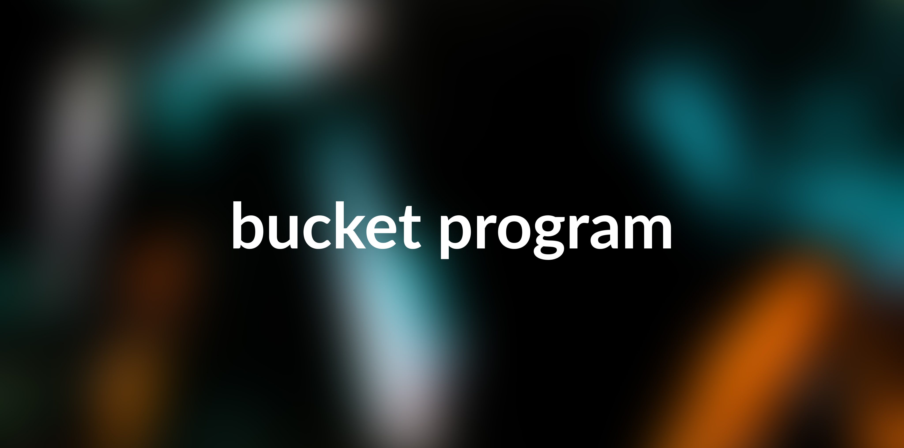
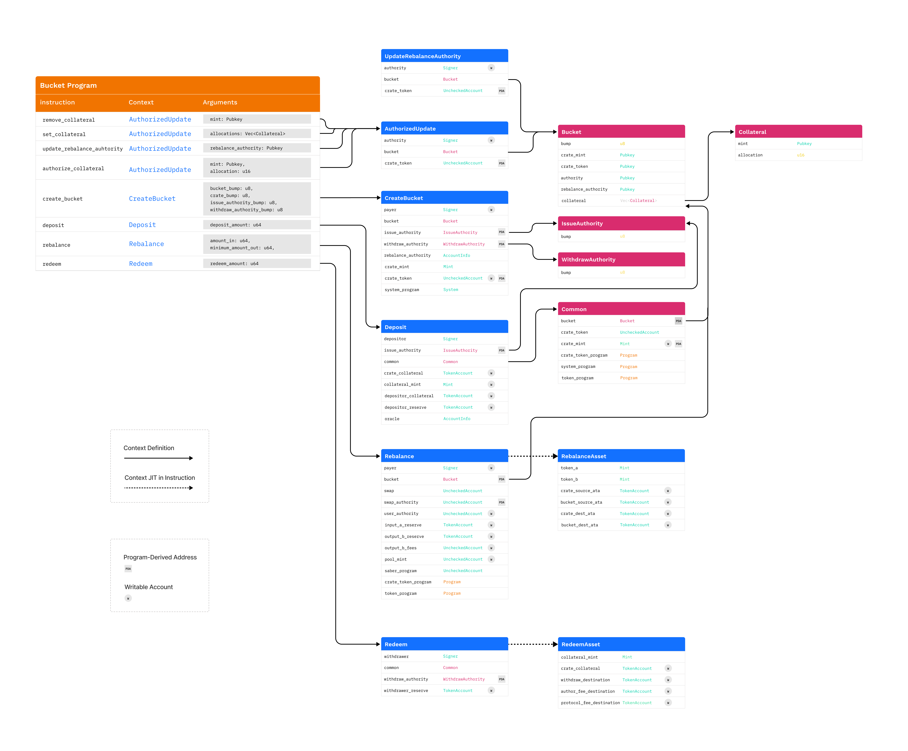

# bucket-program

<div>
    <div align="center">
        
    </div>
    <span>
        Background courtesy of <a href="https://unsplash.com/@7henrique1993">Henrique Malaguti</a> on <a href="https://unsplash.com">Unsplash</a>
    </span>
</div>

## Description

Bucket aims to be a composable stablecoin by aggregating a diversified pool of stablecoins to increase decentralization and decrease single points of failure. In a world of abundant stablecoins, bucket strives to provide value in 2 ways: protocol-to-bucket and consumer-to-bucket. For a more in depth description, please visit our [website](https://bucketdao.com). Bucket builds on top of a variety open source programs in the Solana ecosystem: [Crate Protocol](https://github.com/CrateProtocol/crate), [Saber's stable swap](https://github.com/saber-hq/stable-swap), and more.

The team started this project at [mtnDAO](https://twitter.com/mtnDAO) for [Solana's Riptide Hackathon](https://solana.com/riptide). We are in active development. For the latest updates, follow our journey:

- [Website](https://bucketdao.com)
- [Twitter](https://twitter.com/bucket_sol)
- [Litepaper](https://docs.google.com/document/d/1_GOjncQYXdtBtDilnhC1_wZllG9nEKJgOS7xX4IV2H4/)

<div>
    <div align="center">
        
    </div>
    <span>
        Diagram of on-chain architecture.
    </span>
</div>

## Respository overview

- `cli/`

  - Interact with the deployed bucket program via the CLI instead of the UI. There is 1-1 mapping between on-chain instructions and CLI commands. There are also some extra utility functions to help surface data currently stored on-chain, e.g. view bucket PDA attributes, see a user's parsed ATAs, etc.

- `programs/`

  - Folder containing all on-chain programs. We only deploy the bucket-program program. The pyth program is purely for localnet testing since pyth's oracle price feeds are not available locally.

- `scripts/`

  - Various bash scripts to make common actions easier such as setting up a dev environment, copying IDLs, deploying a program, etc.

- `sdk/`

  - The package that allows you to easily interact with a deployed bucket program. There is a 1-1 mapping between SDK functions and on-chain instructions. The SDK is beneficial because it abstracts away a lot of complexity of finding addresses, building transactions, and more.

- `tests/`
  - The directory containing code and helpers to test the end-to-end functionality of the bucket program. These tests are a great way to understand how the bucket program works + how to interact with the program.

## Rust Crates

#### Custom

These rust crates are produced by running anchor build.

| Package          | Description          | Version | Docs    |
| :--------------- | :------------------- | :------ | :------ |
| `bucket-program` | Core bucket protocol | pending | pending |

#### Dependencies

These rust crates are imported across this repo's programs' Cargo.toml files. Disclaimer: our programs do not necessarily the latest versions, as displayed in the table below. Check the Cargo.toml or Cargo.lock for specific crate versions.

| Package              | Description                                                       | Version                                                                                                         | Docs                                                                                           |
| :------------------- | :---------------------------------------------------------------- | :-------------------------------------------------------------------------------------------------------------- | :--------------------------------------------------------------------------------------------- |
| `anchor-spl`         | CPI clients for SPL programs                                      | [](https://crates.io/crates/anchor-spl)                 | [](https://docs.rs/anchor-spl)                 |
| `anchor-lang`        | Solana Sealevel eDSL                                              | [](https://crates.io/crates/anchor-lang)               | [](https://docs.rs/anchor-lang)               |
| `stable-swap-anchor` | Anchor bindings for the StableSwap Rust client                    | [](https://crates.io/crates/stable-swap-anchor) | [](https://docs.rs/stable-swap-anchor) |
| `crate-token`        | Fractional ownership of a basket of assets                        | [](https://crates.io/crates/crate-token)               | [](https://docs.rs/crate-token)               |
| `vipers`             | Assorted checks and validations for writing safer Solana programs | [](https://crates.io/crates/vipers)                         | [](https://docs.rs/vipers)                         |
| `pyth-client`        | Pyth price oracle data structures and example usage               | [](https://crates.io/crates/pyth-client)                  | [](https://docs.rs/pyth-client)               |

## JavaScript/Web3.js

To interact with a deployed bucket from your own programa, use [the JavaScript SDK.](https://github.com/bucket-dao/bucket-program/tree/main/sdk)

You can install this package in your repo with the following command

`npm i @bucket-program/sdk`

## Developing

### Getting Started

#### Solana specific

You'll need to install a couple development tools if this is your first time developing on Solana. We recommend starting with the following getting started guides:

- [Solana cookbook](https://solanacookbook.com/getting-started/installation.html#macos-linux)
- [Anchor book](https://book.anchor-lang.com/chapter_2/getting_started.html)

#### Other

By this point, you should have

- [yarn](https://classic.yarnpkg.com/lang/en/docs/install), and
- [npm](https://docs.npmjs.com/cli/v7/configuring-npm/install)

If not, it doesn't hurt to install these now. Many projects ues these tools. You will also need `ts-mocha` installed globally to run our tests. You can install it via NPM like so:

`npm i -g ts-mocha`

You might need to run the above command with `sudo` prepended. Verify it's installed by running `ts-mocha`. You should see output like this:

```sh
Error: No test files found: "test"
```

#### Installation

We provide a simple script to install dependencies, build packages. Simply run

```
yarn setup
```

#### Troubleshooting

The respective projects' documentation sites and discords are a great place to start when troubleshooting issues.

### Tests

Make sure you previously built the SDK and installed all relevant packages. Then, you can run all the tests with:

```sh
anchor test
```

## Licensing

[Apache 2.0](./LICENSE).
